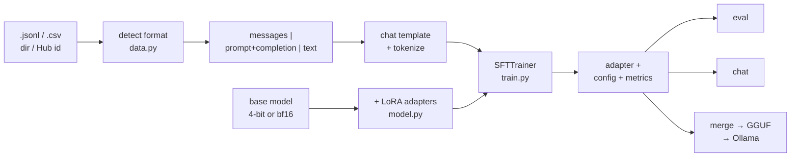

<div align="center">

# 🎛️ tunekit

### Fine-tune an open LLM in one command — and know whether it worked.

[](https://github.com/Dolmaa24/tunekit/actions/workflows/ci.yml)
[](https://pypi.org/project/tunekit/)
[](https://pypi.org/project/tunekit/)
[](LICENSE)
[](https://colab.research.google.com/github/Dolmaa24/tunekit/blob/main/notebooks/tunekit_colab.ipynb)

</div>

<!-- Banner/demo placeholder: drop a terminal recording here.
     asciinema rec demo.cast && agg demo.cast docs/demo.gif
     then:  -->

```console
$ tunekit train --model Qwen/Qwen2.5-1.5B-Instruct --data my_data.jsonl --set model.load_in_4bit=true
data: 98 train / 2 eval  (messages -> messages, dropped 0)
model: Qwen/Qwen2.5-1.5B-Instruct  dtype=bfloat16 4-bit  trainable 18.5M / 907M (2.04%)
schedule: effective batch 16, ~6 steps/epoch, 12 total steps, lr 0.0002
done in 139.0s  train_loss=2.0417  eval_loss=1.0439  peak_vram=3.04 GB
saved to outputs/run   try it:  tunekit chat outputs/run
```

---

## Why this exists

Fine-tuning a 7B model with QLoRA is ~150 lines everyone rewrites, and the bugs live in the parts nobody enjoys: dataset shapes, chat templates, pad tokens, quantisation flags, and the sinking feeling at the end when you can't tell whether it helped. tunekit does those parts once.

## ✨ Key features

- 🧩 **Any dataset, auto-detected** — `messages`, Alpaca, ShareGPT, prompt/completion, raw text; from `.jsonl` / `.json` / `.csv` / `.parquet`, a directory, or a Hugging Face Hub id. Bad rows are dropped **and counted with a reason**, not thrown as a stack trace.
- 🔍 **Look before you leap** — `tunekit validate` prints the exact text the model will train on, token-length percentiles, and how many rows will be truncated.
- 🪶 **LoRA or QLoRA from one flag** — 4-bit / 8-bit via bitsandbytes, sensible defaults for rank, alpha, scheduler and checkpointing.
- 📊 **"Did it help?" answered** — `tunekit eval` scores the held-out split with the tuned *and* base model, side-by-side sample generations included. It tells you when the set is too small to mean anything.
- 💾 **Memory honesty** — `tunekit info --model X` reports weight size against your GPU *before* a 15 GB download; every run records its own `peak_vram_gb`.
- 📦 **Ships to where models run** — `merge` → `export` gives you a GGUF and an Ollama `Modelfile`. Verified end-to-end through `ollama run`.
- ♻️ **Reproducible** — every output dir gets the resolved config, metrics and a model card.

## 🚀 Quick start

```bash
pip install tunekit            # LoRA
pip install "tunekit[quant]"   # + QLoRA (bitsandbytes; Linux + NVIDIA)
```

```bash
tunekit info                                                    # what your hardware supports
tunekit validate --data my_data.jsonl                           # check the data first
tunekit train --model Qwen/Qwen2.5-0.5B-Instruct --data my_data.jsonl
tunekit eval outputs/run                                        # tuned vs base, with samples
tunekit chat outputs/run                                        # talk to it
```

Prefer a config file for anything you'll run twice:

```bash
tunekit init config.yaml
tunekit train config.yaml --set train.lr=1e-4 --set model.load_in_4bit=true
```

Ready-made configs in [`configs/`](configs/):

| config | model | method | VRAM |
|---|---|---|---|
| `quickstart-smoke.yaml` | SmolLM2-135M | LoRA | any (CPU ok, ~1 min) |
| `qwen2.5-0.5b-lora.yaml` | Qwen2.5-0.5B | LoRA bf16 | ~4 GB |
| `llama-3.2-3b-qlora.yaml` | Llama-3.2-3B | QLoRA 4-bit | ~6 GB (free Colab T4) |
| `qwen2.5-7b-qlora.yaml` | Qwen2.5-7B | QLoRA 4-bit | ~12 GB |
| `hub-dataset-example.yaml` | Qwen2.5-0.5B | LoRA, data from the Hub | ~4 GB |

## 🏗️ Architecture



Built on the standard stack, deliberately: **PyTorch**, **Hugging Face Transformers**, **PEFT**, **TRL** (`SFTTrainer`), **Datasets**, with **Typer** + **Rich** for the CLI and **Pydantic** for config validation. Nothing here is a fork — if you outgrow tunekit, your adapter is a plain PEFT adapter.

## ⚙️ Configuration

tunekit is configured by YAML, not environment variables. Everything is optional except `model.name` and `data.path`, and any key can be overridden with `--set section.key=value`.

<details>
<summary><b>Full configuration reference</b> (click to expand)</summary>

```yaml
model:
  name: Qwen/Qwen2.5-0.5B-Instruct
  load_in_4bit: false        # QLoRA (needs tunekit[quant])
  load_in_8bit: false
  dtype: auto                # auto | bfloat16 | float16 | float32
  attn_implementation: null  # flash_attention_2 | sdpa | eager
  trust_remote_code: false
  chat_template: null        # override the tokenizer's Jinja chat template (rarely needed)

data:
  path: data/train.jsonl     # file, directory, or Hub id
  format: auto               # auto | messages | alpaca | sharegpt | prompt_completion | text
  split: train               # Hub datasets only
  subset: null               # Hub dataset config/subset name
  eval_path: null
  eval_fraction: 0.02
  max_samples: null
  system_prompt: null
  max_length: 2048
  shuffle_seed: 42
  text_field: text           # column names, when auto-detection can't find them
  prompt_field: prompt
  completion_field: completion

lora:
  enabled: true              # false = full fine-tune
  r: 16
  alpha: 32
  dropout: 0.05
  target_modules: all-linear # or [q_proj, k_proj, v_proj, o_proj]
  use_rslora: false
  use_dora: false
  modules_to_save: null      # e.g. [embed_tokens, lm_head]

train:
  output_dir: outputs/run
  epochs: 1
  max_steps: -1              # > 0 overrides epochs
  batch_size: 2
  grad_accum: 8
  lr: 2.0e-4
  scheduler: cosine
  warmup_ratio: 0.03
  weight_decay: 0.0
  max_grad_norm: 1.0
  optimizer: adamw_torch     # paged_adamw_8bit is a good QLoRA choice
  gradient_checkpointing: true
  packing: false
  assistant_only_loss: false # needs a chat template with  markers
  logging_steps: 10
  eval_steps: null           # null = every epoch
  save_steps: null
  save_total_limit: 2
  seed: 42
  report_to: [none]          # [wandb] | [tensorboard]
  run_name: null             # defaults to the output_dir's name
  dataloader_num_workers: 0
  resume_from_checkpoint: false
  extra: {}                  # passed straight to TRL's SFTConfig

hub:
  push: false
  repo_id: null
  private: true
```

</details>

The environment variables tunekit and its dependencies respect:

| Variable | Used for | Default |
|---|---|---|
| `HF_TOKEN` | gated models (Llama) and higher Hub rate limits | unset |
| `HF_HOME` | where model weights are cached | `~/.cache/huggingface` |
| `HF_HUB_OFFLINE` | fail instead of hitting the network | `0` |
| `LLAMA_CPP_DIR` | where `tunekit export` looks for llama.cpp | `~/llama.cpp` |
| `CUDA_VISIBLE_DEVICES` | pick or hide GPUs | all |

## 📖 Usage examples

<details open>
<summary><b>Check the data before spending GPU time</b></summary>

```console
$ tunekit validate --model Qwen/Qwen2.5-1.5B-Instruct --data examples/pirate.jsonl
format: messages -> messages
rows: 98 train / 2 eval / 0 dropped
┏━━━━━┳━━━━━┳━━━━━┳━━━━━┳━━━━━┳━━━━━━┓
┃ min ┃ p50 ┃ p90 ┃ p99 ┃ max ┃ mean ┃
┡━━━━━╇━━━━━╇━━━━━╇━━━━━╇━━━━━╇━━━━━━┩
│  44 │  61 │  69 │  73 │  73 │ 60.7 │
└─────┴─────┴─────┴─────┴─────┴──────┘
~5,953 tokens per epoch
────────────────────────── example 0 ──────────────────────────
<|im_start|>system
You are Qwen, created by Alibaba Cloud. You are a helpful assistant.<|im_end|>
<|im_start|>user
Say hello.<|im_end|>
<|im_start|>assistant
Ahoy there, me hearty! Welcome aboard!<|im_end|>
dataset OK
```

</details>

<details>
<summary><b>Will this model fit my GPU?</b></summary>

```console
$ tunekit info --model Qwen/Qwen2.5-7B-Instruct
tunekit 0.1.1
hardware: cuda: Tesla T4, 15.6 GB (bf16=yes)
bitsandbytes (QLoRA): available
Qwen/Qwen2.5-7B-Instruct: 15.2 GB of weights on disk
  resident base weights: bf16 ~15.2 GB | 8-bit ~8.4 GB | 4-bit ~4.6 GB  (LoRA params, optimizer state and activations come on top)
   bf16: tight
  8-bit: fits
  4-bit: fits
```

</details>

<details>
<summary><b>Did the fine-tune actually help?</b></summary>

```console
$ tunekit eval outputs/qlora --samples 1
scoring 2 examples from the eval split  (messages)
┏━━━━━━━━━━━━━━━━━━━━━━━━━━━━━━━┳━━━━━━━━┳━━━━━━━━━━━━┓
┃ model                         ┃   loss ┃ perplexity ┃
┡━━━━━━━━━━━━━━━━━━━━━━━━━━━━━━━╇━━━━━━━━╇━━━━━━━━━━━━┩
│ base: Qwen/Qwen2.5-1.5B-Inst… │ 4.9060 │    135.095 │
│ tuned: outputs/qlora          │ 2.2814 │      9.791 │
└───────────────────────────────┴────────┴────────────┘
tuned loss is lower than base by 2.6246 nats/token
caution: only 2 example(s) and 37 scored tokens — too few to read much into
these numbers. Raise data.eval_fraction, or point --data at a larger file.
─────────────────────────── sample 0 ───────────────────────────
prompt:    What is the largest ocean?
reference: The Pacific, matey — biggest an' deepest o' them all, arr!
base:      The largest ocean in terms of surface area is the Pacific Ocean…
tuned:     The Pacific Ocean, of course! It's got more water than any other sea.
```

</details>

<details>
<summary><b>Ship it to Ollama</b></summary>

```bash
tunekit merge outputs/run outputs/merged
pip install "tunekit[gguf]"
git clone --depth 1 https://github.com/ggml-org/llama.cpp ~/llama.cpp
tunekit export outputs/merged --quant q8_0 --ollama
ollama create my-model -f outputs/merged/Modelfile && ollama run my-model
```

</details>

<details>
<summary><b>Python API</b></summary>

```python
from tunekit.config import RunConfig
from tunekit.train import run
from tunekit.inference import load_for_inference, stream_reply

cfg = RunConfig.from_dict({
    "model": {"name": "Qwen/Qwen2.5-0.5B-Instruct"},
    "data": {"path": "data.jsonl"},
})
out_dir = run(cfg)

model, tok = load_for_inference(str(out_dir), load_in_4bit=True)
print("".join(stream_reply(model, tok, [{"role": "user", "content": "hello"}])))
```

</details>

## 🧮 Data formats

tunekit reads the first row and picks the converter. All conversational formats become OpenAI-style `messages`; the tokenizer's own chat template is then applied, so the model trains on exactly the prompt format it sees at inference.

| format | row shape | notes |
|---|---|---|
| `messages` | `{"messages": [{"role": "user", "content": "…"}, …]}` | canonical; multi-turn ok; list-of-parts content flattened |
| `alpaca` | `{"instruction": "…", "input": "…", "output": "…"}` | `input` optional; also `question`/`answer`, `prompt`/`response` |
| `sharegpt` | `{"conversations": [{"from": "human", "value": "…"}, …]}` | |
| `prompt_completion` | `{"prompt": "…", "completion": "…"}` | loss on completion only; no chat template |
| `text` | `{"text": "…"}` | continued pre-training / raw text |

## 🖥️ Hardware notes

| setup | what works |
|---|---|
| NVIDIA, ≥ 16 GB | everything; 7B QLoRA comfortably, 13B QLoRA with `batch_size: 1` |
| NVIDIA, 15 GB (free Colab T4) | **measured:** Qwen2.5-1.5B QLoRA at `batch_size: 4`, `max_length: 1024` peaks at **3.04 GB**, 12 steps in 139 s. QLoRA up to ~7B fits. |
| multiple GPUs | `accelerate launch -m tunekit.cli train config.yaml` (data-parallel) |
| Apple Silicon | LoRA on models that fit in unified memory; **no** 4-bit/8-bit (bitsandbytes is CUDA-only). For serious Mac training use [mlxtuner](https://github.com/Dolmaa24/mlxtuner) |
| CPU | smoke tests only (`configs/quickstart-smoke.yaml`) |

Every run records its own `peak_vram_gb` in `tunekit.json`, so you can check these claims on your own GPU — and please [open an issue](https://github.com/Dolmaa24/tunekit/issues) with the number.

Rules of thumb: QLoRA memory ≈ 0.7 GB per billion params + activations; halve `max_length` or `batch_size` before touching LoRA rank; `lr: 2e-4` for LoRA, `1e-5`–`2e-5` for full fine-tunes.

## 🧭 Commands

| command | what it does |
|---|---|
| `tunekit info [run_dir] [--model X]` | hardware; whether model X fits; or a finished run's metrics |
| `tunekit init [path]` | write a commented starter config |
| `tunekit validate` | detect/convert the dataset, token stats, rendered examples |
| `tunekit train` | fine-tune; `--dry-run` loads everything and exits |
| `tunekit eval <path>` | held-out loss / perplexity + samples, tuned vs base |
| `tunekit chat <path>` | interactive chat; `--load-in-4bit` for QLoRA adapters |
| `tunekit merge <adapter> <out>` | fold LoRA weights into the base model |
| `tunekit export <merged> [--ollama]` | GGUF via llama.cpp + an Ollama Modelfile |
| `tunekit push <dir> <repo_id>` | upload a run to the Hugging Face Hub |

## ❓ FAQ

<details>
<summary><b>Loss goes down but the model doesn't change</b></summary>

Too few steps, or too small a rank for the shift you want. Check `tunekit validate` shows the format you expect, then try `epochs: 3`, `lora.r: 32`.
</details>

<details>
<summary><b><code>CUDA out of memory</code></b></summary>

In order: `load_in_4bit: true` → lower `data.max_length` → `batch_size: 1` with higher `grad_accum` → `optimizer: paged_adamw_8bit`.
</details>

<details>
<summary><b><code>ImportError: Found an incompatible version of torchao</code></b></summary>

peft rejects an outdated torchao that some environments (Colab especially) preinstall. tunekit doesn't use torchao: `pip uninstall -y torchao`, or `pip install -U torchao`. This only bites at *load* time — 4-bit training returns before peft reaches that check, so a run can train fine and then fail at `chat`.
</details>

<details>
<summary><b>A QLoRA adapter won't fit at inference</b></summary>

`chat` and `eval` load the base model in full precision by default. Pass `--load-in-4bit` to reload it quantised, the way it was trained — otherwise a 7B QLoRA adapter needs ~15 GB instead of ~5 GB.
</details>

<details>
<summary><b>The model rambles / never stops</b></summary>

The base model's chat template and EOS handling matter. Use the `-Instruct` variant, and check your assistant turns don't end with trailing junk.
</details>

## 🗺️ Roadmap

- [x] `eval` — held-out loss / perplexity + sample generations, tuned vs base
- [x] `push` — upload a run to the Hub
- [x] Peak VRAM recorded per run
- [ ] Preference tuning (DPO / ORPO) via TRL's `DPOTrainer`, reusing the data layer
- [ ] Auto-suggest `batch_size` / `max_length` from detected VRAM
- [ ] Vision-language models (Qwen2-VL, LLaVA)
- [ ] A `` helper for chat templates, so `assistant_only_loss` works more widely

## 🤝 Contributing

Issues and PRs welcome — new dataset formats, model-family quirks, export targets, and **hardware reports** are all useful. The last one is the cheapest way to help: run something, then open an issue with your `tunekit info` and the `peak_vram_gb` from the run.

See [CONTRIBUTING.md](CONTRIBUTING.md) for setup, layout and the test commands. In short:

```bash
git clone https://github.com/Dolmaa24/tunekit && cd tunekit
pip install -e ".[dev]"
ruff check src tests && pytest -m "not integration"
```

## 📄 License

[Apache-2.0](LICENSE). Models and datasets you fine-tune keep their own licenses.

---

<div align="center">
<sub>Training on a Mac? See the sibling project <a href="https://github.com/Dolmaa24/mlxtuner">mlxtuner</a> — same dataset formats, MLX instead of CUDA.</sub>
</div>
